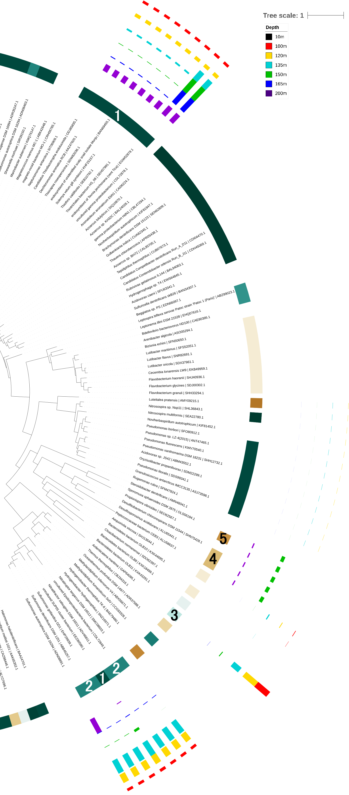

# Methods

NorC DNA & RNA abuundance was plotted against depth.
Abundances were stratified at the family and class levels.
NorC RNA abundance was correlated with NO3, N2O and NH4.
Abundances were also correlated with nitrogen species NH4, N2O, NO2, and NO3.

## Setup 

Analysis was completed in R v3.4.3 [???] using the following packages.
```{r eval=TRUE, message=FALSE, warning=FALSE}
library(tidyverse)
library(cowplot)
library(phyloseq)
library(grid)
library(knitr)
```

Taxonomy, abundance, and query data were loaded from "marker_contig_map.tsv" files obtained from TreeSAPP.
```{r message=FALSE}

treesapp.out.dir = "./treesapp_out_gene_tax_abd/"

norC.DNA.10m = read_tsv(paste(treesapp.out.dir, "dna/10m/final_outputs/marker_contig_map.tsv", sep="")) %>% 
  select(Tax.DNA.10 = Confident_Taxonomy, Abund.DNA.10 = Abundance, Query)
norC.DNA.100m = read_tsv(paste(treesapp.out.dir, "dna/100m/final_outputs/marker_contig_map.tsv", sep="")) %>% 
  select(Tax.DNA.100 = Confident_Taxonomy, Abund.DNA.100 = Abundance, Query)
norC.DNA.120m = read_tsv(paste(treesapp.out.dir, "dna/120m/final_outputs/marker_contig_map.tsv", sep="")) %>% 
  select(Tax.DNA.120 = Confident_Taxonomy, Abund.DNA.120 = Abundance, Query)
norC.DNA.135m = read_tsv(paste(treesapp.out.dir, "dna/135m/final_outputs/marker_contig_map.tsv", sep="")) %>% 
  select(Tax.DNA.135 = Confident_Taxonomy, Abund.DNA.135 = Abundance, Query)
norC.DNA.150m = read_tsv(paste(treesapp.out.dir, "dna/150m/final_outputs/marker_contig_map.tsv", sep="")) %>% 
  select(Tax.DNA.150 = Confident_Taxonomy, Abund.DNA.150 = Abundance, Query)
norC.DNA.165m = read_tsv(paste(treesapp.out.dir, "dna/165m/final_outputs/marker_contig_map.tsv", sep="")) %>% 
  select(Tax.DNA.165 = Confident_Taxonomy, Abund.DNA.165 = Abundance, Query)
norC.DNA.200m = read_tsv(paste(treesapp.out.dir, "dna/200m/final_outputs/marker_contig_map.tsv", sep="")) %>% 
  select(Tax.DNA.200 = Confident_Taxonomy, Abund.DNA.200 = Abundance, Query)

norC.RNA.10m = read_tsv(paste(treesapp.out.dir, "RNA/10m/final_outputs/marker_contig_map.tsv", sep="")) %>% 
  select(Tax.RNA.10 = Confident_Taxonomy, Abund.RNA.10 = Abundance, Query)
norC.RNA.100m = read_tsv(paste(treesapp.out.dir, "RNA/100m/final_outputs/marker_contig_map.tsv", sep="")) %>% 
  select(Tax.RNA.100 = Confident_Taxonomy, Abund.RNA.100 = Abundance, Query)
norC.RNA.120m = read_tsv(paste(treesapp.out.dir, "RNA/120m/final_outputs/marker_contig_map.tsv", sep="")) %>% 
  select(Tax.RNA.120 = Confident_Taxonomy, Abund.RNA.120 = Abundance, Query)
norC.RNA.135m = read_tsv(paste(treesapp.out.dir, "RNA/135m/final_outputs/marker_contig_map.tsv", sep="")) %>% 
  select(Tax.RNA.135 = Confident_Taxonomy, Abund.RNA.135 = Abundance, Query)
norC.RNA.150m = read_tsv(paste(treesapp.out.dir, "RNA/150m/final_outputs/marker_contig_map.tsv", sep="")) %>% 
  select(Tax.RNA.150 = Confident_Taxonomy, Abund.RNA.150 = Abundance, Query)
norC.RNA.165m = read_tsv(paste(treesapp.out.dir, "RNA/165m/final_outputs/marker_contig_map.tsv", sep="")) %>% 
  select(Tax.RNA.165 = Confident_Taxonomy, Abund.RNA.165 = Abundance, Query)
norC.RNA.200m = read_tsv(paste(treesapp.out.dir, "RNA/200m/final_outputs/marker_contig_map.tsv", sep="")) %>% 
  select(Tax.RNA.200 = Confident_Taxonomy, Abund.RNA.200 = Abundance, Query)
```

Data was combined into a single data frame.
```{r, warning=FALSE}
# Combine the data frames
norC.all = norC.DNA.10m %>% 
  full_join(norC.DNA.100m, by = "Query") %>% 
  full_join(norC.DNA.120m, by = "Query") %>% 
  full_join(norC.DNA.135m, by = "Query") %>% 
  full_join(norC.DNA.150m, by = "Query") %>% 
  full_join(norC.DNA.165m, by = "Query") %>% 
  full_join(norC.DNA.200m, by = "Query") %>% 
  full_join(norC.RNA.10m,  by = "Query") %>% 
  full_join(norC.RNA.100m, by = "Query") %>% 
  full_join(norC.RNA.120m, by = "Query") %>% 
  full_join(norC.RNA.135m, by = "Query") %>% 
  full_join(norC.RNA.150m, by = "Query") %>% 
  full_join(norC.RNA.165m, by = "Query") %>% 
  full_join(norC.RNA.200m, by = "Query") %>% 
# Create a taxonomy variable aggregating all taxonomy columns to fill in any NAs
  mutate(Taxonomy = ifelse(!is.na(Tax.DNA.10), Tax.DNA.10,
                    ifelse(!is.na(Tax.DNA.100), Tax.DNA.100,
                    ifelse(!is.na(Tax.DNA.120), Tax.DNA.120,
                    ifelse(!is.na(Tax.DNA.135), Tax.DNA.135,
                    ifelse(!is.na(Tax.DNA.150), Tax.DNA.150,
                    ifelse(!is.na(Tax.DNA.165), Tax.DNA.165,
                    ifelse(!is.na(Tax.DNA.200), Tax.DNA.200,
                    ifelse(!is.na(Tax.RNA.10), Tax.RNA.10,
                    ifelse(!is.na(Tax.RNA.100), Tax.RNA.100,
                    ifelse(!is.na(Tax.RNA.120), Tax.RNA.120,
                    ifelse(!is.na(Tax.RNA.135), Tax.RNA.135,
                    ifelse(!is.na(Tax.RNA.150), Tax.RNA.150,
                    ifelse(!is.na(Tax.RNA.165), Tax.RNA.165,
                    ifelse(!is.na(Tax.RNA.200), Tax.RNA.200,
                           "unclassified"))))))))))))))) %>% 
# Remove old Tax variables
  select(-starts_with("Tax.")) %>% 
# Gather all the abundance data into 1 column 
  gather("Key", "Abundance", starts_with("Abund")) %>% 
# Turn the Key into Depth and RNA/DNA variables
  separate(Key, c("Key","Type","Depth_m"), by = ".") %>% 
# Remove Key variable and reorder the columns with Query at the end
  select(Depth_m, Type, Abundance, Taxonomy, Query) %>% 
# Make depth numerical
  mutate(Depth_m = as.numeric(Depth_m)) %>% 
# Separate Taxonomy into columns
  separate(Taxonomy, into = c("Domain", "Phylum", "Class", "Order", "Family", "Genus", "Species"), sep="; ")
```

Note that not all queries could be classified at the species level, so those cells were filled in with NA.

Geochemical data from cruise 72 (Aug 1, 2012) was loaded in order to draw correlations with norC abundance.

```{r}
load("mothur_phyloseq.RData")
metadata = data.frame(mothur@sam_data)
```

# Results

## NorC DNA and RNA Abundance with Depth

```{r fig.width=5, fig.height=4}

gene_abd_depth = norC.all %>% 
  group_by(Depth_m, Type) %>% 
  filter(!is.na(Abundance)) %>%
  summarize(Abundance = sum(Abundance)) %>% 
  mutate(Abundance = round(Abundance, digits = 2)) 
#%>% mutate(Abundance = ifelse(Abundance == 0, NA, Abundance))

ggplot(gene_abd_depth, aes(x = Type, y = Depth_m)) +
  geom_point(aes(size = Abundance)) +
  geom_text(aes(label = Abundance, hjust = -0.5)) +
  scale_y_reverse(lim=c(200,10)) +
  labs(caption = "Figure ??? RPKM abundance (value labels) of norC \nat the genome and expression level across different \ndepths.", x = NULL) + 
  theme(legend.position="none", plot.caption = element_text(size = 12, hjust = 0), plot.margin=margin(0,40,0,20))

```


The abundance of norC differs with depth. No norC gene was found at either the genome or expression level above 100m. For DNA the abundance is increasing with depth until 150m, where it is maximal. Then the abundance abruptly drops at 165m, and then is relatively high again at 200m. For RNA, norC abundance is relatively low up to depth 135m, only slowly increasing. Then the abundance is notably greater at 150m, and maximum RNA abundance is reached at 165m. Then RNA abundance decreases again at 200m.  

The graph shows that the abundance of DNA differs from the abundance of RNA. DNA abundance is notably higher at depths up to depth 150m. DNA abundance is maximal at 150m, where RNA abundance is lower, and RNA abundance is maximal at 165m, where DNA abundance is quite low. 

## Families Responsible for norC Abundance

**Figure ???**
FPKM RNA abundance (coloured bars from purple to red) of norC expression across sample depth with respect to taxonomic assignments. Selected clades are numbered (1: Gammaproteobacteria; 2: Epsilonproteobacteria; 3: Ardenticatenia; 4: Clostridia; 5: Negativicutes). FPKM bar heights are relative within the same colour only. NorC expression is not observed in species outside of what is shown.  
<br><br>

The expression of norC is observed to be localized to a few clades. Clades with the highest levels of norC expression are variable with respect to depth. Epsilonproteobacteria and Ardenticatenia were observed to have greater expression at 135m or above, while Gammaproteobacteria expression is more biased towards greater depths.

```{r fig.width=7, fig.height=5}
norC.all %>% 
# Change NAs to "unclassified"
  mutate(Family = ifelse(is.na(Family), "unclassified", Family)) %>% 
  mutate(Abundance = ifelse(Abundance == 0, NA, Abundance)) %>%

ggplot(aes(x = Family, y = Depth_m)) +
# Make 0 values not show up, keep points from overlapping
  geom_point(aes(size = Abundance, color = Type), position = position_dodge(0.6)) +
  scale_y_reverse(lim=c(200,10)) +
  labs(caption = "Figure ??? RPKM abundance of norC stratified at the family level. Abundance is \nshown at both the genome and expression level across different depths. The size of \neach circle is proportional to abundance.", x = "Family") + 
  theme(axis.text.x = element_text(angle = 20, hjust = 1), plot.caption = element_text(size = 12, hjust = 0),plot.margin= margin(0,0,0,20))
```

In total seven fully classified families were found to contribute to the norC DNA and RNA levels, along with some unclassified *Thiotrichales* and fully unclassified organisms. All classified families that contribute some amount to the DNA levels, were found to also contribute a nonzero amount to the RNA levels.  

A different number of classified families was found to contribute to the DNA and RNA levels at different depths. The smallest number of classified families, only three, contribute at depths of 100m, 120m, and 165m, while the biggest number of classified families, six, contribute at a depth of 150m. Some families were found to contribute to norC levels only at one depth, while others contribute at more depths.  

At every depth, the family *Candidatus Thioglobus* was found to contribute the most to norC DNA abundance, while the second biggest contributors were unclassified organisms. The biggest contributors to RNA abundance at the majority of depths were found to be unclassified organisms. This is while at depth 200m *Helicobacteraceae* contribute the most to RNA abundance.  

```{r}
norC.all %>% 
# Change NAs to "unclassified"
  mutate(Class = ifelse(is.na(Class), "unclassified", Class)) %>% 
  mutate(Abundance = ifelse(Abundance == 0, NA, Abundance)) %>%

ggplot(aes(x = Class, y = Depth_m)) +
# Make 0 values not show up, keep points from overlapping
  geom_point(aes(size = Abundance, color = Type), position = position_dodge(0.6)) +
  scale_y_reverse(lim=c(200,10)) +
  labs(caption = "Figure ??? RPKM abundance of norC stratified at the class level. Abundance is \nshown at both the genome and expression level across different depths. The size of \neach circle is proportional to abundance.", x = "Class") + 
  theme(axis.text.x = element_text(angle = 20, hjust = 1), plot.caption = element_text(size = 12, hjust = 0),plot.margin= margin(0,0,0,20))
```

## NorC Abundance and Nitrogen Species

```{r}
plot_abd_depth = ggplot(gene_abd_depth, aes(x = Type, y = Depth_m)) +
  geom_point(aes(size = Abundance)) +
  scale_y_reverse(lim=c(200,10)) +
  labs(x = "", y = NULL) + 
  theme(plot.margin = unit(c(0,0,0.55,0), "cm"))
```


```{r}
# Order the data by depth
metadata_depth = metadata %>% arrange(Depth_m)

plot_NO3 = metadata_depth %>% 
ggplot(aes(x = NO3_uM, y = Depth_m)) +
  geom_point() +
  geom_path(aes(group = 1)) +
  scale_y_reverse(lim=c(200,10)) +
  labs(y = "Depth (m)",
       x = "NO3 (uM)") +
  theme(axis.text.x = element_text(angle = 90, hjust = 1),
        plot.margin = unit(c(0,0.1,0.3,0), "cm"))

plot_NO2 = metadata_depth %>% 
ggplot(aes(x = NO2_uM, y = Depth_m)) +
  geom_point() +
  geom_path(aes(group = 1)) +
  scale_y_reverse(lim=c(200,10)) +
  labs(y = NULL,
       x = "NO2 (uM)") +
  theme(axis.text.x = element_text(angle = 90, hjust = 1),
        plot.margin = unit(c(0,0.1,0,0), "cm"))

plot_NH4 = metadata_depth %>% 
ggplot(aes(x = NH4_uM, y = Depth_m)) +
  geom_point() +
  geom_path(aes(group = 1)) +
  scale_y_reverse(lim=c(200,10)) +
  labs(y = NULL,
       x = "NH4 (uM)") +
  theme(axis.text.x = element_text(angle = 90, hjust = 1),
        plot.margin = unit(c(0,0.1,0.5,0), "cm"))

plot_N2O = metadata_depth %>% 
ggplot(aes(x = N2O_nM, y = Depth_m)) +
  geom_point() +
  geom_path(aes(group = 1)) +
  scale_y_reverse(lim=c(200,10)) +
  labs(y = NULL,
       x = "N2O (nM)") +
  theme(axis.text.x = element_text(angle = 90, hjust = 1),
        plot.margin = unit(c(0,0.1,0.3,0), "cm"))
```

```{r fig.width=8, fig.height=4}
# Create composite figure
plot_grid(plot_NO3, plot_NO2, plot_N2O, plot_NH4, plot_abd_depth, 
          labels=c("A", "B", "C", "D", "E"), 
          nrow = 1, 
          rel_widths=c(1.2,1,1,1,1.95))
```
**Figure ???** Nitrogen species concentrations across depths (A-D) compared to norC abundances at both the genome and expression levels (E; reproduced from Figure ???)


The relation between norC abundance and nitrogen species was examined. NO3 and N2O concentrations were seen to peak at 100m. NO2 decreased with depth, while NH4 was only present at greater depths.

```{r fig.width=12, fig.height=6}

gene_abd_depth_meta = metadata %>% 
  mutate(N2O_uM = N2O_nM / 1000) %>% 
  select(Depth_m, NH4_uM, N2O_uM, NO2_uM, NO3_uM) %>% 
  rename("NH4 (uM)" = NH4_uM) %>% 
  rename("N2O (uM)" = N2O_uM) %>% 
  rename("NO2 (uM)" = NO2_uM) %>% 
  rename("NO3 (uM)" = NO3_uM) %>% 
  gather(Nutrient,uM,-Depth_m) %>% 
  full_join(gene_abd_depth, by = "Depth_m") %>% 
  unite(Type_Nutrient, Type, Nutrient, sep = " - ") %>% 
  arrange(desc(Type_Nutrient))
# TODO not all are uM so x axis shouldn't be um
ggplot(gene_abd_depth_meta, aes(x = uM, y=Abundance)) +
  geom_point() +
  facet_wrap(~Type_Nutrient, scales="free", ncol = 4) +
  geom_smooth(method='lm') +
  labs(caption = "Figure ??? RPKM abundance of norC at different nitrogen species concentrations. Abundance is shown at both the genome and expression level.",
       y = "Abundance", x = "Concentration (uM)") + 
  theme(plot.caption = element_text(size = 12, hjust = 0))

```

The presence and expression of the norC gene was only positively associated with NH4 levels, while all other correlations revealed negative trends.

```{r}
RNA_abundance = data.frame(matrix(ncol = 5, nrow= 0))

for (type_nutrient in unique(gene_abd_depth_meta$Type_Nutrient)) {
  # get the summary of lm()
  summ = gene_abd_depth_meta %>%
    filter(Type_Nutrient == type_nutrient) %>% 
    lm(Abundance ~ uM, .) %>%
    summary()
  # pull out the stats values of the slope
  coef = summ$coefficients["uM",]
  # convert into a data frame
  coef_data_frame = data.frame(coef=matrix(coef),row.names=names(coef))
  # add to table
  RNA_abundance[nrow(RNA_abundance) + 1,] <-c(type_nutrient, round(coef_data_frame[,1], 4))
}

colnames(RNA_abundance) <- (c("Correlation", "Estimate", "Std. Error","t value","Pr(>|t|) (p-value)"))
kable(RNA_abundance,caption="Table ??? Correlation of norC Abundance Across Nitrogen Species Concentrations.")

```

NorC expression was found to significantly correlate to NH4 levels (p = 0.0047). No other significant correlations were found at either the genome or the expression level.  

Expression level significances (p = 0.0047-0.2728) were also higher than those of the genome level (p = 0.2021-0.9512). 